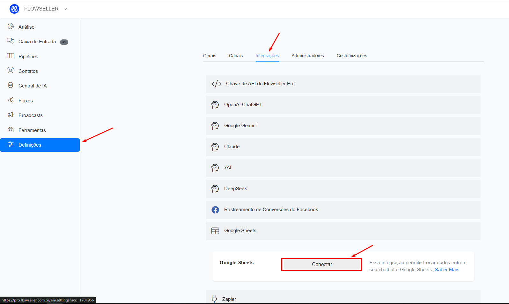

# Campo personalizado e obtenção de dados do usuário

_Tempo estimado de leitura: 2 min_ :hourglass\_flowing\_sand:

Os campos personalizados na Flowseller atuam como variáveis ​​para armazenar as informações do usuário, como e-mail, número de telefone, preferência e muito mais, com base em suas necessidades e no processo de construção do bot.

Os dados do campo personalizado podem ser armazenados em diferentes formatos, como,

* Texto,
* Número,
* Data,
* Data hora,
* Verdadeiro falso

### Crie um campo personalizado

Você pode criar o campo personalizado na seção de fluxo.

Vá em _**Menu > Fluxos > Campos Personalizados**_

<figure><figcaption></figcaption></figure>

Clique no botão “Adicionar” se desejar adicionar um campo personalizado. Na imagem abaixo você pode preencher o nome e digitar conforme sua necessidade, e não esqueça de preencher os dados do campo personalizado no campo de descrição. Mesmo que a “descrição” seja opcional, esta informação irá ajudá-lo quando você tiver vários campos personalizados no futuro.

<figure><figcaption></figcaption></figure>

<figure><figcaption></figcaption></figure>

Na imagem abaixo você pode preencher o nome e digitar conforme sua necessidade, e não esqueça de preencher os dados do campo personalizado no campo de descrição. Mesmo que a “descrição” seja opcional, esta informação irá ajudá-lo quando você tiver vários campos personalizados no futuro.

Agora você verá como podemos usar este campo personalizado no fluxo de chat para armazenar as informações do usuário no fluxo automaticamente.

### Usando campo personalizado no fluxo de chat

Se você já criou o campo personalizado para salvar a entrada (informações) do usuário, tudo bem. Ou você também pode criar um campo personalizado enquanto cria o fluxo.

Selecione o fluxo onde deseja usar esse recurso de campo personalizado.

No fluxo, utilize “Obter dados do usuário” para coletar informações de seus assinantes (semelhante à imagem abaixo).

<figure><figcaption></figcaption></figure>

Em seguida, clique no botão “Editar” para configurar o assistente de campo personalizado.

<figure><figcaption></figcaption></figure>

Agora, escolha o campo personalizado se você já o tiver criado ou pode criar um novo campo personalizado aqui no próprio assistente.

<figure><figcaption></figcaption></figure>

<figure><figcaption></figcaption></figure>

E esta entrada do usuário será armazenada no respectivo campo personalizado como dissemos antes. Você pode ver essas informações de campo personalizado nos detalhes individuais do público.

Ao consultar os campos personalizados você pode ver que a cor verde fornecida pelo usuário foi armazenada no respectivo campo personalizado.

Espero que este artigo ajude você a entender mais sobre o recurso de campo personalizado na plataforma Flowseller.

Se ainda tiver dúvidas, acesse outros artigos da base de conhecimento entre em contato com nosso suporte para tirar suas dúvidas.

### Campos para contatos

**\{{first\_name\}}**\
\&#xNAN;**\{{last\_name\}}**\
\&#xNAN;**\{{full\_name\}}**\
\&#xNAN;**\{{email\}}**\
\&#xNAN;**\{{phone\}}**\
\&#xNAN;**\{{user\_country\}}**\
\&#xNAN;**\{{user\_state\}}**\
\&#xNAN;**\{{user\_city\}}**\
\&#xNAN;**\{{inbox\_link\}}:** link da conversa na Flowseller.\
\&#xNAN;**\{{gender\}}**\
\&#xNAN;**\{{locale\}}**: Idioma da conversa. Exemplo pt\_BR\
\&#xNAN;**\{{locale2\}}:** Idioma da conversa. Example br\
\&#xNAN;**\{{ig\_user\_name\}}** : @ no instagram do contato.\
\&#xNAN;**\{{ig\_followers\}}:** Quantidade de seguidores do contato.\
\&#xNAN;**\{{ig\_verified\}}:** Verifica se o instagram do contato é verificado.\
\&#xNAN;**\{{ig\_follow\_business\}}:** Indica se o usuário segue o seu perfil ou não.\
\&#xNAN;**\{{ig\_business\_follow\_user\}}:** Indica se a empresa segue o contato ou não.\
\&#xNAN;**\{{profile\_pic\}}**\
\&#xNAN;**\{{timezone\}}**: Deslocamento de fuso horário como +2\
\&#xNAN;**\{{timezone\_name\}}**: exemplo: South América/Sao\_paulo\
\&#xNAN;**\{{user\_id\}}** : O ID do usuário de contato na Flowseller. Use este ID na API.\
\&#xNAN;**\{{subscribed\_date\}}** : a data em que o contato foi criado.\
\&#xNAN;**\{{fb\_chat\_link\}}** : O link direto para a caixa de entrada do Facebook de um contato.\
\&#xNAN;**\{{me\}}** : Contém um link onde o contato pode visualizar e excluir seus dados. Isso ajuda as empresas a se manterem em conformidade com o LGPD/GDPR.\
\&#xNAN;**\{{user\_code\}}**\
\&#xNAN;**\{{last\_btt\_title\}}**\
\&#xNAN;**\{{last\_interaction\}}**\
\&#xNAN;**\{{last\_order\}}**\
\&#xNAN;**\{{last\_seen\}}**\
\&#xNAN;**\{{last\_input\}}**: o último texto, imagem, vídeo, áudio, arquivo ou mensagem de voz enviado pelo usuário.\
\&#xNAN;**\{{last\_input\_type\}}**: texto, imagem, vídeo, áudio, arquivo.\
\&#xNAN;**\{{consecutive\_failed\_reply\}}**\
\&#xNAN;**\{{last\_ref\}}** : o último link de ponto de entrada clicado pelo contato.\
\&#xNAN;**\{{last\_ad\}}** : o último ID de anúncio que leva o contato ao seu bot.\
\&#xNAN;**\{{user\_channel\}}**: o canal principal do contato.\
\&#xNAN;**\{{user\_hash\}}**\
\&#xNAN;**\{{user\_tags\}}** – contém o nome de todas as tags aplicadas a um contato.\
\&#xNAN;**\{{user\_external\_id\}}**: o ID do usuário do Viber.\
\&#xNAN;**\{{user\_source\}}**: Ads, Facebook/IG comment, Direct, Imported, API, Inbound Message, Desconhecido …\
\&#xNAN;**\{{assigned\_admin\_name\}}**\
\&#xNAN;**\{{assigned\_admin\_email\}}**\
\&#xNAN;**\{{assigned\_admin\_id\}}**\
\&#xNAN;**\{{current\_user\_time\}}**\
\&#xNAN;**\{{chat\_history\}}:** retornar as últimas 50 mensagens entre o usuário e a empresa.\
\&#xNAN;**\{{chat\_history\_large\}}:** retornar as últimas 200 mensagens entre o usuário e a empresa.\
\&#xNAN;**\{{chat\_history\_details\}}:** como \{{chat\_history\}}, mas inclui QUEM enviou a mensagem.\
\&#xNAN;**\{{chat\_history\_details\_large\}}**: como \{{chat\_history\_details\}}, mas inclui QUEM enviou a mensagem.\
\&#xNAN;**\{{user\_notes\}}**: as notas adicionadas ao usuário.\
\&#xNAN;**\{{last\_user\_note\}}**: a última nota adicionada ao usuário.\
\&#xNAN;**\{{webchat\}}**: Contém um link que permite ao usuário continuar uma conversa de qualquer canal no webchat.\
\&#xNAN;**\{{webchat\_parent\_url\}}**: contém a URL da página na qual o webchat é carregado.

### Account fields

**\{{account\_id\}}**\
\&#xNAN;**\{{account\_name\}}**\
\&#xNAN;**\{{account\_image\}}**\
\&#xNAN;**\{{api\_key\}}**: a chave de API da sua conta.

### Facebook/Instagram Auto Comment fields

**\{{total\_new\_tagged\}}** : Número de usuários que não estão na sua lista de contatos e que foram marcados no comentário. Funciona apenas no Facebook.\
\&#xNAN;**\{{total\_tagged\}}** : Número de usuários que não foram marcados no comentário. Funciona apenas no Facebook.\
\&#xNAN;**\{{last\_fb\_comment\}}**: o texto do último comentário de um usuário.\
\&#xNAN;**\{{last\_post\_id\}}** : o ID da postagem do último post comentado pelo usuário.\
\&#xNAN;**\{{last\_comment\_id\}}** :o ID da postagem do último post comentado pelo usuário.

### Instagram Story Reply fields

**\{{last\_story\_id\}}**

### Messenger

**\{{page\_user\_name\}}**

### Viber

**\{{viber\_bot\_username\}}**

### Voice

**\{{last\_call\_recorded\}}** : Contém o link para a última chamada gravada.

### Location

**\{{last\_latitude\}}** : disponível somente se o usuário tiver compartilhado sua localização.\
\&#xNAN;**\{{last\_longitude\}}** : disponível somente se o usuário tiver compartilhado sua localização.

### Pipelines fields

**\{{last\_opportunity\_id\}}**: contém o ID da última oportunidade atualizada ou criada.

### Booking fields

**\{{booking\_date\}}**\
\&#xNAN;**\{{booking\_link\}}**\
\&#xNAN;**\{{booking\_id\}}**\
\&#xNAN;**\{{booking\_calendar\}}**

### E-commerce fields

**\{{cart\_checkout\_link\}}**\
\&#xNAN;**\{{cart\_last\_item\_name\}}**\
\&#xNAN;**\{{cart\_last\_item\_quantity\}}**\
\&#xNAN;**\{{cart\_num\_items\}}**\
\&#xNAN;**\{{cart\_other\_fees\}}**\
\&#xNAN;**\{{cart\_shipping\_cost\}}**\
\&#xNAN;**\{{cart\_subtotal\}}**\
\&#xNAN;**\{{cart\_total\}}**\
\&#xNAN;**\{{cart\_products\}}**\
\&#xNAN;**\{{shop\_link\}}**\
\&#xNAN;**\{{money\_symbol\}}**\
\&#xNAN;**\{{order\_coupon\_code\}}**\
\&#xNAN;**\{{order\_coupon\_discount\}}**\
\&#xNAN;**\{{order\_date\_account\_timezone\}}**\
\&#xNAN;**\{{order\_date\_timestamp\}}**\
\&#xNAN;**\{{order\_date\_utc\}}**\
\&#xNAN;**\{{order\_discount\}}**\
\&#xNAN;**\{{order\_email\}}**\
\&#xNAN;**\{{order\_id\}}**\
\&#xNAN;**\{{order\_name\}}**\
\&#xNAN;**\{{order\_payment\_method\}}**\
\&#xNAN;**\{{order\_phone\}}**\
\&#xNAN;**\{{order\_products\}}**\
\&#xNAN;**\{{order\_shipping\_type\}}**\
\&#xNAN;**\{{order\_shipping\_address1\}}**\
\&#xNAN;**\{{order\_shipping\_address2\}}**\
\&#xNAN;**\{{order\_shipping\_city\}}**\
\&#xNAN;**\{{order\_shipping\_cost\}}**\
\&#xNAN;**\{{order\_shipping\_state\}}**\
\&#xNAN;**\{{order\_shipping\_zip\}}**\
\&#xNAN;**\{{order\_shipping\_country\}}**\
\&#xNAN;**\{{order\_shipping\}}**\
\&#xNAN;**\{{order\_status\}}**\
\&#xNAN;**\{{order\_subtotal\}}**\
\&#xNAN;**\{{order\_taxes\}}**\
\&#xNAN;**\{{order\_total\}}**: exemplo 1000\
\&#xNAN;**\{{order\_total\_formatted\}}**: valor formatado. Exemplo: R$ 1.000,00\
\&#xNAN;**\{{product\_name\}}**: use-o com o gatilho “Produto pedido” ou “Produto adicionado ao carrinho”.\
\&#xNAN;**\{{product\_quantity\}}**: use-o com o gatilho “Produto pedido” ou “Produto adicionado ao carrinho”.\
\&#xNAN;**\{{product\_id\}}**: use-o com o gatilho “Usuário perguntou sobre um produto”, “Produto pedido”, “Produto adicionado ao carrinho” ou “Produto removido do carrinho”.

### Campos do questionário

**\{{last\_points\}}**: contém o total de pontos do último questionário preenchido por um contato.

### Other fields

**\{{last\_step\}}:** Contém o STEP ID da etapa executada anteriormente. Funciona somente se usado em fluxos publicados.\
\&#xNAN;**\{{current\_step\}}**: Contém o STEP ID da etapa ativa atual. Funciona somente se usado em fluxos publicados.\
\&#xNAN;**\{{admin\_name\}}**: contém o nome do administrador que envia a mensagem ou fluxo da caixa de entrada.

**\{{last\_input\_failure\}}**:Inclui o motivo da falha do comando GET USER DATA. Os valores possíveis são timeout, user\_skipped e invalid\_input\_attempts.

\\
