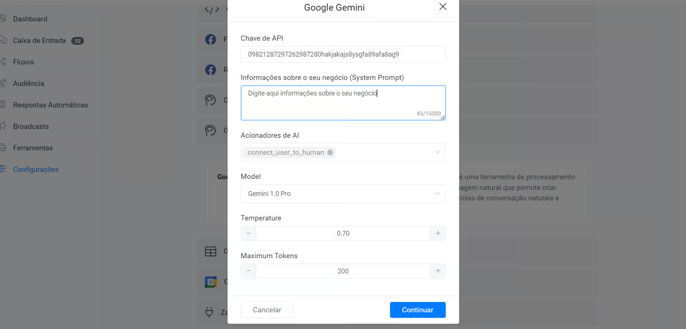

# 🧠 Google Gemini

_Tempo estimado de leitura: 1 min_ :hourglass\_flowing\_sand:

A Flowseller integrou o Google Gemini para permitir que as empresas melhorem o atendimento ao cliente e, ao mesmo tempo, economizem drasticamente custos e recursos humanos.

As empresas podem treinar o Google Gemini para responder a quaisquer perguntas dos clientes relacionadas aos seus negócios. Um chatbot permite que as empresas respondam instantaneamente aos seus clientes, 24 horas por dia, resultando em maior satisfação do cliente. Além disso, é uma solução económica, reduzindo a necessidade de recursos humanos adicionais nas operações de apoio ao cliente.

A chave para criar um chatb

ot excelente para o seu negócio é criar um bom prompt (Informações Comerciais). O cérebro do seu chatbot é o seu prompt. Sua solicitação deve ser clara e bem escrita.

## **Conecte o Google Gemini ao** Flowseller

1 – Obtenha sua chave API Gemini [AQUI](https://aistudio.google.com/app/prompts/new_chat)

<figure><figcaption></figcaption></figure>

2 – Vá na Flowseller> Configurações > Integrações > Google Gemini

<figure><figcaption></figcaption></figure>

3 – Clique no botão **Conectar** e forneça sua **API KEY**.

<figure><figcaption></figcaption></figure>

Após conectar você vai visualizar a tela completa de gerenciamento do Google Gemini na Flowseller

<figure><figcaption></figcaption></figure>

## **Acionando um fluxo**

Para saber como acionar um fluxo usando IA, consulte Gatilhos de IA .

## **Transferir uma conversa para um humano**

Implementamos um gatilho de IA integrado que interrompe automaticamente a automação do bot e transfere uma conversa para um humano quando o usuário deseja falar com um agente humano.

## **Prioridade da automação (Hierarquia da plataforma)**

Depois de conectar o Google Gemini a Flowseller, seu chatbot se comunicará automaticamente usando IA sempre que um usuário enviar uma mensagem para seu chatbot. Nenhuma ação é necessária de sua parte.

E a plataforma Flowseller respeitará sua hierarquia, priorizando sempre as configurações na seguinte ordem:

1 – Respostas Automatizadas.\
2 – Fluxo de diálogo\
3 – OpenAI\
4 – Google Gemini

## **Desativar o acionamento automático do Gemini**

Cada vez que um usuário envia uma mensagem ao seu chatbot, ele usará automaticamente o Gemini para responder à mensagem do usuário. Você pode querer trabalhar apenas com ações do Gemini no construtor de fluxo. Você pode desativar esse comportamento acessando **Configurações** -> **Integrações** -> **Google Gemini** e desativando a opção **Automatizar Respostas** .

Assim azul claro está ativado.

<figure><figcaption></figcaption></figure>

Assim cinza claro estará desativado

<figure><figcaption></figcaption></figure>
